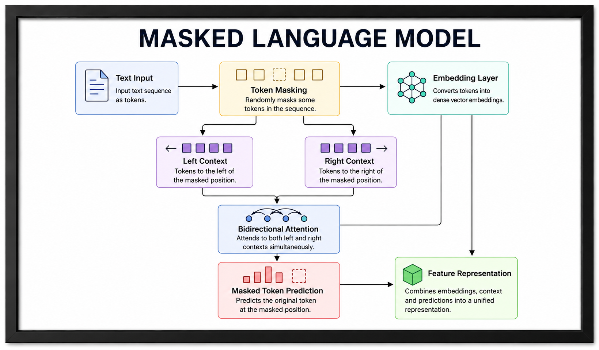
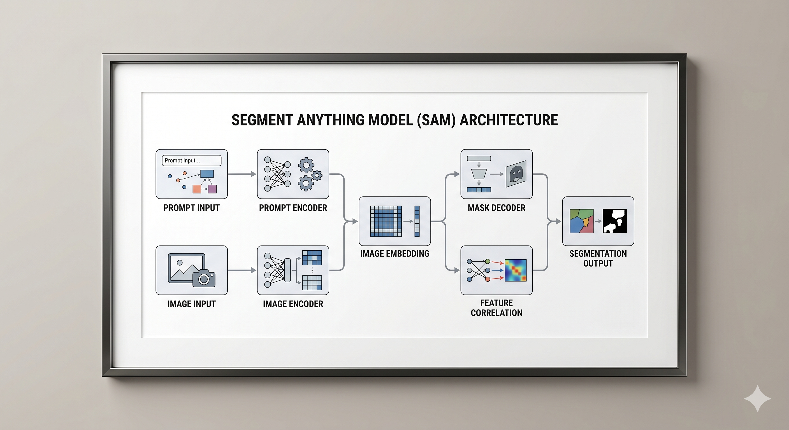

<h1 align="center">🚀 Specialized AI Architectures</h1>

<p align="center">
  <strong>Eight production‑grade AI agent pipelines.</strong><br>
  Designed as engineered software systems — not prompt experiments.
</p>

<p align="center">
  🧠 <b>Contract-Bound</b> &nbsp;•&nbsp; 🔍 <b>Deterministic</b> &nbsp;•&nbsp; ⏱ <b>Observable</b> &nbsp;•&nbsp; 📦 <b>Composable</b>
</p>

---

## 🔎 The Engineering Signal

This repository demonstrates how to bridge the gap between AI research and production software. Every pipeline is built with:

- **Strict Validation:** Pydantic-enforced contracts between every stage.
- **Deterministic Paths:** Explicit execution flows that eliminate "black box" behavior.
- **Deep Observability:** Microsecond-level traceability for auditing and debugging.
- **Architectural Primitives:** Modular components designed for rapid, scalable system composition.

---

## 🛠 What’s Inside

- **8 Structured Blueprints:** Battle-tested agent architectures.
- **Production Implementations:** Runnable code with strict interface validation.
- **Orchestration Patterns:** Reusable logic for complex multi-stage reasoning.
- **Audit-Ready Flows:** Transparent execution suitable for regulated environments.

---

<p align="center">
  <strong>AI systems should be engineered, not improvised.</strong><br>
  This repository is the blueprint for that transition.
</p>

---

## Table of Contents

- [Technical Stack](#️-technical-stack)
- [Project Overview](#️-project-overview)
- [Quickstart](#-quickstart)
- [Agent 1: LLM (Large Language Model)](#-agent-1-llm-large-language-model)
- [Agent 2: LCM (Large Concept Model)](#-agent-2-lcm-large-concept-model)
- [Agent 3: LAM (Large Action Model)](#-agent-3-lam-large-action-model)
- [Agent 4: MoE (Mixture of Experts)](#-agent-4-moe-mixture-of-experts)
- [Agent 5: VLM (Vision-Language Model)](#-agent-5-vlm-vision-language-model)
- [Agent 6: SLM (Small Language Model)](#-agent-6-slm-small-language-model)
- [Agent 7: MLM (Masked Language Model)](#-agent-7-mlm-masked-language-model)
- [Agent 8: SAM (Segment Anything Model)](#-agent-8-sam-segment-anything-model)
- [Model Comparison](#-model-comparison)
- [Logging & Observability](#-logging--observability)
- [Contributing](#-contributing)
- [Security & Secrets](#-security--secrets)

---

## 🏗️ Project Overview

This architecture treats AI pipelines as strict, sequential data contracts. Each stage is a discrete, validated component with well-defined input/output schemas.

### ⚙️ Core Engineering Features (Shared)

| Feature                   | Detail                                                                                                               |
| :------------------------ | :------------------------------------------------------------------------------------------------------------------- |
| **Type Safety**           | Pydantic v2 models validate data boundaries and enforce semantic correctness between pipeline stages                 |
| **Production Resiliency** | Exponential backoff (base 2, max 32s) with adaptive retry logic; circuit-breaker pattern prevents cascading failures |
| **State Checkpointing**   | `state_checkpointer.py` saves intermediate stage payloads for resumption and deduplication of API calls              |
| **Deep Observability**    | Structured per-stage logging via `logging_setup.py`; nanosecond-level timings via `time.perf_counter()`              |
| **Modularity**            | Abstract base class `BaseAIAgent` enforces a uniform interface across all agent architectures                        |

---

## 🚀 Quickstart

**Prerequisites:** Python 3.11+

```bash
# Install dependencies
uv venv
source .venv/bin/activate
uv pip install -r requirements.txt

# Configure environment
cp .env.example .env
# Edit .env with your GITHUB_TOKEN and GITHUB_ENDPOINT

# Run an agent
python3 LLM.py
```

---

## 🔵 Agent 1: LLM (Large Language Model)

### Description

The LLM Agent is a lightweight, production-grade pipeline that transforms raw text into structured, semantically-rich outputs through a deterministic, sequential architecture: **Validation → Tokenization → Embedding → Transformer → Output Assembly**.

**Pipeline Flow:**

<div align="center">
  
</div>

| Stage                     | Role                                                                | Implementation                                         |
| :------------------------ | :------------------------------------------------------------------ | :----------------------------------------------------- |
| **Input**                 | Raw text ingestion                                                  | Pydantic-validated input model                         |
| **Sentence Segmentation** | Split text into atomic conceptual units                             | `nltk` sentence tokenizer                              |
| **SONAR Embedding**       | Language-agnostic concept-space encoding (simulated)                | OpenAI embeddings + SONAR-style mean pooling           |
| **Diffusion Refinement**  | Iterative concept stabilization via noise injection + normalization | Multi-step Gaussian perturbation loop                  |
| **Advanced Patterning**   | Extract high-level abstract patterns                                | `gpt-4.1` structural analysis pass                     |
| **Hidden Process**        | Latent concept clustering & cross-sentence inference                | Cosine similarity clustering (greedy, threshold-based) |
| **Quantization**          | Compress float32 concept vectors to int8 codes (lossy)              | Scalar quantization + codebook mapping                 |
| **Output**                | Structured concept graph + generated insight                        | Pydantic output with all stage payloads                |

### Use Cases

| Use Case                            | Description                                                                                                                     |
| :---------------------------------- | :------------------------------------------------------------------------------------------------------------------------------ |
| **Auditable Conversational Agents** | Chat applications requiring strict provenance: logs input parameters, system prompts, and token usage for compliance or billing |
| **RAG Pre-processing Pipelines**    | Systems needing both the transformer response and the embedded vector of the user input for downstream semantic similarity      |
| **Format-Strict Text Generation**   | Environments where inputs must be guaranteed to fall under maximum token thresholds before invoking expensive inference         |

---

## 🟢 Agent 2: LCM (Large Concept Model)

### Description

The LCM Agent is an advanced analytical pipeline that operates in _latent concept space_ rather than surface token space. By treating segmented sentences as atomic conceptual units, it simulates Meta's SONAR-style architecture using mean-pooled sentence embeddings, applies a diffusion-inspired refinement loop, and extracts deep structural patterns across the text.

**Pipeline Flow:**

<div align="center">
  
</div>

| Stage                     | Role                                                                | Implementation                                         |
| :------------------------ | :------------------------------------------------------------------ | :----------------------------------------------------- |
| **Input**                 | Raw text ingestion                                                  | Pydantic-validated input model                         |
| **Sentence Segmentation** | Split text into atomic conceptual units                             | `nltk` sentence tokenizer                              |
| **SONAR Embedding**       | Language-agnostic concept-space encoding (simulated)                | OpenAI embeddings + SONAR-style mean pooling           |
| **Diffusion Refinement**  | Iterative concept stabilization via noise injection + normalization | Multi-step Gaussian perturbation loop                  |
| **Advanced Patterning**   | Extract high-level abstract patterns                                | `gpt-4.1` structural analysis pass                     |
| **Hidden Process**        | Latent concept clustering & cross-sentence inference                | Cosine similarity clustering (greedy, threshold-based) |
| **Quantization**          | Compress float32 concept vectors to int8 codes (lossy)              | Scalar quantization + codebook mapping                 |
| **Output**                | Structured concept graph + generated insight                        | Pydantic output with all stage payloads                |

### 🧠 Agent Capabilities

- **Language-Agnostic Concept Pooling:** Generates per-sentence embeddings and mean-pools them into a unified concept vector, approximating SONAR-style language-agnostic representations without requiring local LASER2/SONAR model weights.
- **Diffusion-Inspired Refinement:** Employs an iterative loop that injects decaying Gaussian noise into the concept vector and applies L2-normalization as a stabilization proxy — a computationally tractable approximation of diffusion-based concept refinement.
- **Hidden Process Clustering:** Groups semantically related concept vectors using greedy cosine similarity thresholding and leverages LLM inference to extract cross-cluster emergent insights.
- **Scalar Quantization:** Compresses continuous 1536-d float32 concept vectors into discrete int8 codes, achieving a 4x memory reduction at the cost of measurable reconstruction error.

### Use Cases

| Use Case                              | Description                                                                                                           |
| :------------------------------------ | :-------------------------------------------------------------------------------------------------------------------- |
| **Deep Semantic Analysis**            | Dense texts (academic research, legal contracts) where structural meaning and emergent themes outweigh exact phrasing |
| **Cross-Lingual Concept Mapping**     | Cluster and compare conceptual similarities across documents in different languages via language-agnostic pooling     |
| **Abstract Structural Summarization** | Extract high-level organizational or philosophical patterns using tunable "concept depth" instruction parameters      |

---

## 🟠 Agent 3: LAM (Large Action Model)

### Description

The LAM Agent is an autonomous orchestration system that operates in _action space_ rather than token space. It functions as an "executive function" agent: decomposing complex goals into directed task graphs, validating actions against symbolic rules, maintaining episodic and semantic memory, and recovering from execution failures through adaptive replanning.

**Pipeline Flow:**

<div align="center">
  
</div>

| Stage                          | Role                                          | Implementation                                             |
| :----------------------------- | :-------------------------------------------- | :--------------------------------------------------------- |
| **Input Processing**           | Validate & normalise raw action request       | Pydantic model with intent hints                           |
| **Perception System**          | Sense & classify environment/context          | `gpt-4.1` context analysis → structured percepts           |
| **Intent Recognition**         | Extract goal, sub-goals & constraints         | `gpt-4.1` intent parser → `IntentResult`                   |
| **Task Breakdown**             | Decompose intent into ordered atomic tasks    | `gpt-4.1` planner → `TaskGraph`                            |
| **Action Planning**            | Generate executable action sequences per task | Rule-engine + `gpt-4.1` action synthesiser                 |
| **Memory System**              | Maintain working memory across action steps   | In-process `MemoryStore` (episodic + semantic layers)      |
| **Neuro-Symbolic Integration** | Validate actions against symbolic rules       | Rule-engine with symbolic constraint checker + neural eval |
| **Feedback Integration**       | Simulate execution, collect feedback, re-plan | Feedback loop with up to 3 retry cycles                    |
| **Output**                     | Final action plan + execution trace           | Structured `LAMOutput`                                     |

### 🧠 Agent Capabilities

- **Action-Space Planning:** Decomposes abstract natural language intents into directed task graphs (`TaskBreakdownStage`) and concrete, tool-grounded action sequences with explicit parameters and expected outputs.
- **Dual-Layer Memory System:** Maintains a persistent `MemoryStore` split into _Episodic_ (event-tagged context) and _Semantic_ (fact-based knowledge) layers, enriching highly-relevant planning context continuously.
- **Neuro-Symbolic Validation:** Enforces non-negotiable deterministic safety rules (Symbolic Pass) alongside adaptive contextual evaluation (Neural Pass) before any action is approved for execution.
- **Adaptive Feedback Loops:** Simulates execution of planned actions, automatically triggering self-correction and iterative replanning (up to 3 cycles) when failures are detected.

### Use Cases

| Use Case                           | Description                                                                                                             |
| :--------------------------------- | :---------------------------------------------------------------------------------------------------------------------- |
| **Autonomous Research Assistants** | Long-running multi-step research tasks (search, read, synthesize) with dynamic memory and path adaptation               |
| **DevOps & Infrastructure Bots**   | Code execution or sysadmin agents requiring deterministic guardrails (e.g., "no data deletion without explicit backup") |
| **Enterprise Workflow Automation** | Business processes requiring auditable task breakdowns, tool-call provenance, and resilient failure recovery            |

---

## 🟣 Agent 4: MoE (Mixture of Experts)

### Description

The MoE Agent brings sparse activation patterns — as used in transformer-layer MoE architectures like Mixtral — to the agent orchestration layer. A gating network (Router) scores incoming queries against each expert persona and conditionally activates only the Top-k most relevant experts in parallel, before synthesizing a fused, multi-perspective response.

> **Note:** Traditional MoE (e.g., Mixtral) applies sparse activation at the FFN layer _within_ a transformer block. This agent implements MoE at the orchestration layer — routing between distinct LLM calls with differentiated system prompts — which is architecturally analogous but operates at a coarser granularity.

**Pipeline Flow:**

<div align="center">
  
</div>

| Stage                   | Role                                         | Implementation                                               |
| :---------------------- | :------------------------------------------- | :----------------------------------------------------------- |
| **Input**               | Validated query with expert hints            | Pydantic model with domain classification                    |
| **Router Mechanism**    | Score each expert's relevance                | `gpt-4.1` routing pass → softmax probability distribution    |
| **Expert 1**            | Reasoning & Logic                            | Dedicated `gpt-4.1` call with chain-of-thought system prompt |
| **Expert 2**            | Domain Knowledge                             | Dedicated `gpt-4.1` call with encyclopaedic knowledge prompt |
| **Expert 3**            | Creative Synthesis                           | Dedicated `gpt-4.1` call with divergent thinking prompt      |
| **Expert 4**            | Critical Analysis                            | Dedicated `gpt-4.1` call with adversarial evaluation prompt  |
| **Top-k Selection**     | Filter best k expert outputs by router score | Weighted scoring → top-k filter + confidence gating          |
| **Advanced Patterning** | Extract cross-expert emergent patterns       | `gpt-4.1` meta-synthesis over top-k outputs                  |
| **Quantization**        | Compress gating weights to discrete codes    | Scalar quantization of router probability vector             |
| **Output**              | Fused expert response with full provenance   | `MoEOutput` with per-expert attribution                      |

### 🧠 Agent Capabilities

- **Dynamic Gating & Routing:** Evaluates query relevance across all experts, applying softmax normalization while tracking Shannon entropy and load balance to prevent "expert collapse" (all routing mass concentrating on one expert).
- **Sparse Parallel Execution:** Enforces structural sparsity by calling only Top-k experts simultaneously via `ThreadPoolExecutor`. Each expert uses a unique persona, temperature, and token budget, and self-reports a confidence score.
- **Cross-Expert Meta-Synthesis:** Classifies inter-expert relationships (convergence, divergence, complementary, contradiction) before a weighted fusion pass produces a traceable, synthesized response.
- **Probability Quantization:** Compresses the continuous 4-expert softmax distribution into int8 scalar codes, tracking reconstruction error to quantify precision cost in real time.

### Use Cases

| Use Case                               | Description                                                                                                                         |
| :------------------------------------- | :---------------------------------------------------------------------------------------------------------------------------------- |
| **Multi-Disciplinary Problem Solving** | Complex architectural or strategic queries blending logic, domain expertise, and creative synthesis, routed to best-fit personas    |
| **Adversarial Review Pipelines**       | Automatically routing proposals through "Critical Analysis" and "Domain Expert" experts to stress-test assumptions before synthesis |
| **Dynamic Policy Orchestration**       | Handling highly varied user inputs (code debugging to creative writing) by routing each to a specialized prompt                     |

---

## 🔴 Agent 5: VLM (Vision-Language Model)

### Description

The VLM Agent is a multimodal orchestration pipeline that achieves visual-textual alignment through a sequential, multi-stage architecture. Inspired by dual-encoder designs like LLaVA (linear projection from CLIP to LLaMA) and Flamingo (Perceiver resampler cross-attention), it independently encodes visual feature maps and text embeddings, projects both into a shared latent space, resolves conflicts via simulated cross-attention, and produces grounded, visually-cited responses.

**Pipeline Flow:**

<div align="center">
  
</div>

| Stage                    | Role                                               | Implementation                                            |
| :----------------------- | :------------------------------------------------- | :-------------------------------------------------------- |
| **Image Input**          | Ingest, validate & preprocess image                | Pydantic model; base64 encode from file/URL/bytes         |
| **Text Input**           | Validate textual query/instruction                 | Pydantic model with prompt classification                 |
| **Vision Encoder**       | Extract visual features & patch embeddings         | `gpt-4.1` vision pass → structured visual feature map     |
| **Text Encoder**         | Encode text into semantic representation           | `text-embedding-3-small` → 1536-d semantic vector         |
| **Projection Interface** | Align vision & text into shared latent space       | Linear projection simulation via cosine alignment scoring |
| **Multimodal Processor** | Cross-attention fusion of visual + textual tokens  | `gpt-4.1` multimodal fusion with joint attention prompt   |
| **Language Model**       | Generate grounded output from fused representation | `gpt-4.1` with vision — image + text in single call       |
| **Output Generation**    | Structured, validated multimodal response          | `VLMOutput` with full stage payloads                      |

### 🧠 Agent Capabilities

- **Dual-Stream Encoding:** Independently processes text into dense semantic embeddings while using GPT-4.1's vision capabilities to extract a structured visual feature map (scene type, objects, layout, spatial regions).
- **Latent Space Projection:** Aligns vision and text representations using a cosine-similarity proxy to identify shared explicit concepts and synchronize both modalities before fusion.
- **Simulated Cross-Attention:** Maps specific textual query tokens to visual region IDs, generating a unified multimodal context and resolving visual-textual conflicts before final generation.
- **Grounded Generation:** Forces the language model to cite specific visual regions, producing traceable outputs alongside a computed `grounding_score` that measures hallucination resistance via term-matching heuristics.

### Use Cases

| Use Case                          | Description                                                                                                                 |
| :-------------------------------- | :-------------------------------------------------------------------------------------------------------------------------- |
| **Traceable Visual QA**           | Applications (insurance, medical scan review) where answers must be tied to specific image regions, not generalized guesses |
| **Multimodal RAG Ingestion**      | Pre-processing engine converting raw images into structured JSON metadata (depth, texture, scene) for vector storage        |
| **Spatial & Scene Understanding** | Robotics or autonomous systems needing deductive textual explanation of spatial layouts and object interactions             |

---

## 🟡 Agent 6: SLM (Small Language Model)

### Description

The SLM Agent is an efficiency-first pipeline engineered for resource-constrained environments — mobile devices, edge IoT, and microcontrollers. Inspired by architectures like Phi-3-mini (3.8B) and Gemma 2B, it enforces strict compute, memory, and latency constraints across every stage. Multi-pass token compression, dimensionality reduction, quantization, and KV caching collectively maximize output quality while minimizing operational footprint, culminating in a rigorous efficiency scorecard.

**Pipeline Flow:**

<div align="center">
  
</div>

| Stage                     | Role                                                   | Implementation                                               |
| :------------------------ | :----------------------------------------------------- | :----------------------------------------------------------- |
| **Input Processing**      | Validate, normalise & budget-gate input                | Pydantic model with strict token ceiling & device profile    |
| **Compact Tokenization**  | Aggressive token compression & deduplication           | `tiktoken` + BPE merging simulation + vocabulary pruning     |
| **Optimized Embeddings**  | Lightweight dimension-reduced semantic vectors         | `text-embedding-3-small` with PCA-style reduction to 128-d   |
| **Efficient Transformer** | Inference with compute-budget constraints              | `gpt-4.1` with strict token cap + latency tracking           |
| **Model Quantization**    | Compress representations to low-bit codes              | INT4/INT8 scalar quantization of embedding weights           |
| **Memory Optimization**   | KV-cache simulation + memory footprint profiling       | In-process SHA-256 keyed bounded LRU cache                   |
| **Edge Deployment**       | Package response for resource-constrained targets      | Payload sizing, latency SLA validation, device profile check |
| **Output Generation**     | Validated lightweight response with efficiency metrics | `SLMOutput` with full scorecard                              |

### 🧠 Agent Capabilities

- **Target-Driven Execution Profiles:** Calibrates latency SLAs, RAM limits, payload ceilings, and quantization modes automatically based on declared hardware targets: `CLOUD`, `MOBILE`, `EDGE_IOT`, `MICROCONTROLLER`.
- **Aggressive Data Compression:** Three-pass `CompactTokenizationStage` (truncation, duplicate removal, vocab coverage) plus a seeded Johnson-Lindenstrauss random projection reduces 1536-d embeddings to 128-d (12x memory reduction).
- **Simulated Post-Training Quantization:** Applies INT4/INT8 quantization simulation across 7 neural network layers, tracking per-layer reconstruction MSE. SHA-256 keyed bounded LRU KV-Cache skips recomputation for identical prompts.
- **Strict Edge Deployment Validation:** Shannon entropy-based payload compression gated behind rigid SLAs (latency, size, compression ratio); outputs receive `DEGRADED` status if hardware boundaries are breached.

### Use Cases

| Use Case                            | Description                                                                                                      |
| :---------------------------------- | :--------------------------------------------------------------------------------------------------------------- |
| **IoT & Edge Computing**            | Intelligence on microcontrollers or edge sensors with tight RAM limits and unacceptable round-trip cloud latency |
| **On-Device Mobile Applications**   | Lightweight semantic processing directly on smartphones, managing thermal and battery constraints via KV-caching |
| **Cost-Optimized Batch Processing** | High-throughput cloud batch jobs at a fraction of the compute and memory overhead of a full LLM                  |

---

## 🟤 Agent 7: MLM (Masked Language Model)

### Description

The MLM Agent replicates BERT-style bidirectional pre-training within an orchestrated pipeline. Unlike autoregressive models (which use only left-side context for next-token prediction), this agent constructs independent left-window and right-window contexts for each masked token, fuses them in a joint bidirectional attention pass, and produces token predictions, attention weights, and contextual feature representations for downstream NLP tasks.

**Pipeline Flow:**

<div align="center">
  
</div>

| Stage                       | Role                                              | Implementation                                                       |
| :-------------------------- | :------------------------------------------------ | :------------------------------------------------------------------- |
| **Text Input**              | Validate & classify input for masking strategy    | Pydantic model with masking config                                   |
| **Token Masking**           | Apply BERT-style `[MASK]` — 15% tokens selected   | `tiktoken` + three-way split (80/10/10)                              |
| **Embedding Layer**         | Contextual embeddings for all tokens              | `text-embedding-3-small` per window + sinusoidal positional encoding |
| **Left Context**            | Capture tokens preceding each masked position     | Boundary-aware left-window extractor                                 |
| **Right Context**           | Capture tokens following each masked position     | Boundary-aware right-window extractor                                |
| **Bidirectional Attention** | Fuse left + right context at each masked position | `gpt-4.1` joint left+right context fusion                            |
| **Masked Token Prediction** | Predict original token for each masked position   | `gpt-4.1` Top-k prediction with per-mask confidence                  |
| **Feature Representation**  | Build final contextualised feature vectors        | Pooled `[CLS]`-style + per-token feature vectors                     |

### 🧠 Agent Capabilities

- **Exact BERT Masking Strategy:** Enforces the 80/10/10 token split — 80% `[MASK]` replacement, 10% random token injection, 10% unchanged — to replicate BERT's robust representation learning objective.
- **Dual Vector Representation:** Assigns each token a 1536-d dense semantic embedding (`text-embedding-3-small`) and a 64-d sinusoidal positional encoding following the Vaswani et al. (2017) formula.
- **Explicit Bidirectional Attention:** Extracts precise boundary-aware left and right context windows, fusing them in a single batch pass to compute normalized left/right attention weights and contextual coherence scores.
- **Top-K Prediction & MRR Scoring:** Returns Top-k candidates with calibrated confidence scores; validates outputs using Mean Reciprocal Rank (MRR) and exact-match accuracy.
- **Rich Feature Extraction:** Outputs a `[CLS]`-style sentence vector, mean-pooled sentence vectors, and 64-d per-token features modulated by the bidirectional attention weights.

### Use Cases

| Use Case                               | Description                                                                                                               |
| :------------------------------------- | :------------------------------------------------------------------------------------------------------------------------ |
| **Deep Feature Synthesis**             | Extracting rich sentence-level and per-token embeddings as inputs for downstream classification, clustering, or ML models |
| **Context-Heavy Token Classification** | Foundation for NER, POS tagging, or anomaly detection in dense structured text (legal, medical)                           |
| **Semantic Equivalency & Similarity**  | Leveraging `[CLS]` and mean-pooled representations for document distance and retrieval                                    |

---

## ⚫ Agent 8: SAM (Segment Anything Model)

### Description

The SAM Agent is a zero-shot, promptable orchestration pipeline that replicates Meta's SAM architecture without requiring local ViT weights. It accepts versatile prompts (points, bounding boxes, text, or coarse masks) and decodes them into precise, Run-Length Encoded (RLE) binary masks via advanced visual-spatial reasoning.

**Pipeline Flow:**

<div align="center">
  
</div>

| Stage                   | Role                                                  | Implementation                                                      |
| :---------------------- | :---------------------------------------------------- | :------------------------------------------------------------------ |
| **Prompt Encoder**      | Encode sparse and dense prompts into unified space    | 2D sinusoidal embeddings (sparse) + semantic density maps (dense)   |
| **Image Encoder**       | Simulate ViT-style patch-grid feature extraction      | 16×16 simulation grid via `gpt-4.1` vision + deterministic noise    |
| **Image Embedding**     | Fuse global context and compute spatial attention map | Salience-weighted cosine blend → 16×16 attention heatmap            |
| **Mask Decoder**        | Decode prompt + image context into binary masks       | 3 candidate masks ranked by IoU with COCO-style RLE encoding        |
| **Feature Correlation** | Compute interpretable prompt-patch cross-attention    | Parallel cosine similarity matrix between prompt tokens and patches |
| **Output**              | Final structured segmentation result                  | `SAMOutput` with highest-IoU RLE mask and spatial bounds            |

### 🧠 Agent Capabilities

- **Sparse + Dense Dual Encoding:** Handles point coordinates (foreground/background bias), bounding boxes, dense text descriptions, and coarse mask hints, unifying them into a shared 1536-d latent representation.
- **Patch Grid Simulation:** Projects image regions into a structured 16×16 simulation grid with 256-d patch embeddings as a computationally tractable proxy for full ViT backbone feature extraction.
- **Interpretable Feature Correlation:** Runs an explicit cross-correlation matrix between prompt tokens and image patches, surfacing attention patterns without relying on opaque cross-attention internals.
- **Deterministic RLE Masking:** Forces LLM spatial reasoning outputs into strict coordinate bounds, compiling them into pixel-level RLE strings compliant with COCO dataset annotation standards.

### Use Cases

| Use Case                                | Description                                                                                                     |
| :-------------------------------------- | :-------------------------------------------------------------------------------------------------------------- |
| **Zero-Shot Medical & UI Segmentation** | Isolating complex visual elements based on user clicks without requiring pre-trained semantic class definitions |
| **Bounding-Box to Mask Conversion**     | Refining coarse object detection bounding boxes into precise pixel-level segmentation masks                     |
| **Spatial Auditing & Heatmapping**      | Generating interpretable 2D attention matrices to verify model focus regions for specific text prompts          |

---

## 📊 Model Comparison

| Agent   | Modality                      | Architecture Pattern                 | Inference Cost | Latency Profile | Best For                                       |
| :------ | :---------------------------- | :----------------------------------- | :------------- | :-------------- | :--------------------------------------------- |
| **LLM** | Text → Text                   | Sequential encoder-decoder           | Low            | Low             | General-purpose text generation, RAG           |
| **LCM** | Text → Concept Graph          | Concept-space diffusion pipeline     | Medium         | Medium          | Semantic analysis, cross-lingual mapping       |
| **LAM** | Text → Action Trace           | Multi-stage agentic orchestration    | Very High      | Very High       | Autonomous task execution, workflow automation |
| **MoE** | Text → Fused Text             | Sparse gated parallel routing        | High           | Medium-High     | Multi-perspective analysis, adversarial review |
| **VLM** | Image + Text → Text           | Dual-stream cross-modal fusion       | High           | High            | Visual QA, multimodal RAG, scene understanding |
| **SLM** | Text → Text                   | Compressed efficiency-first pipeline | Very Low       | Very Low        | Edge/IoT deployment, cost-optimized batch      |
| **MLM** | Text → Features + Predictions | Bidirectional masked representation  | Medium         | Medium          | NER, embeddings, fill-mask tasks               |
| **SAM** | Image + Prompt → Mask         | Promptable segmentation pipeline     | High           | High            | Zero-shot segmentation, spatial auditing       |

---

## 📈 Logging & Observability

All agents share a centralized observability stack:

| Component               | Purpose                                                                           |
| :---------------------- | :-------------------------------------------------------------------------------- |
| `logging_setup.py`      | Configures structured, per-agent loggers with stage-level granularity             |
| `state_checkpointer.py` | Saves intermediate stage payloads; enables resumption without redundant API calls |

---

## 🤝 Contributing

- Open an issue for architectural proposals before submitting PRs.
- Maintain backward compatibility with the `BaseAIAgent` abstract interface.
- Ensure strict Pydantic v2 schema adherence for all new data contracts.
- Include stage-level logging hooks in any new pipeline stage.

---

## 🔒 Security & Secrets

- Never commit `.env` files; use `.env.example` as the committed template.
- Logs are sanitized locally — verify that `system_prompt` contents and Pydantic object dumps do not expose user PII before enabling remote log shipping.
- Rotate `GITHUB_TOKEN` credentials on a scheduled basis; treat them as short-lived secrets.

---

<h3 align="center">Made with ❤️ by Jiten.</h3>
