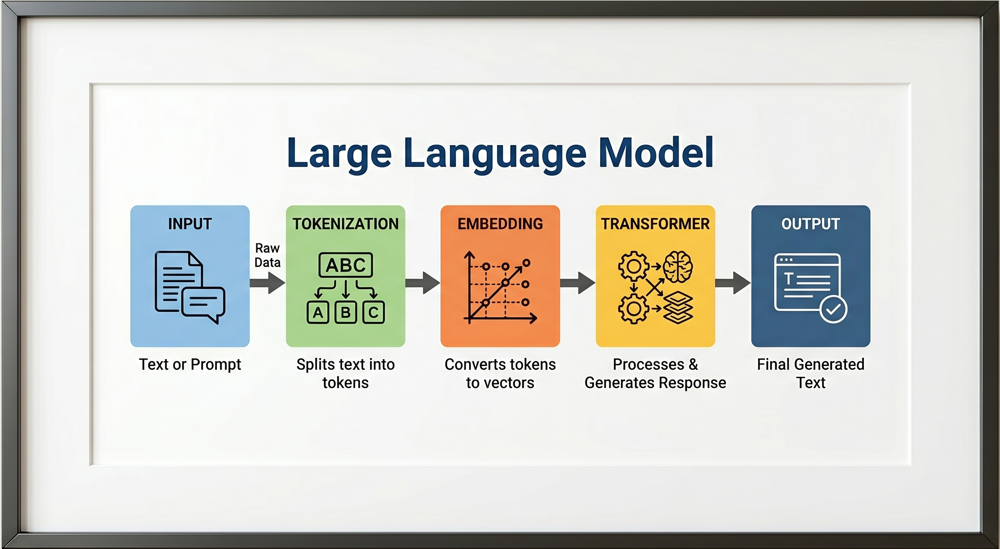
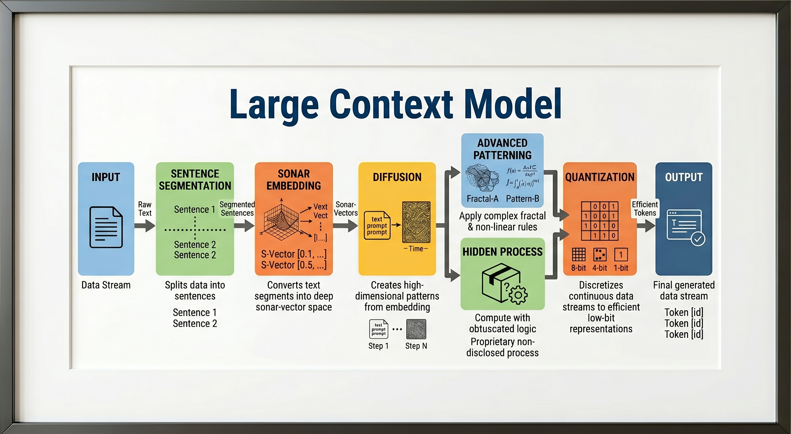
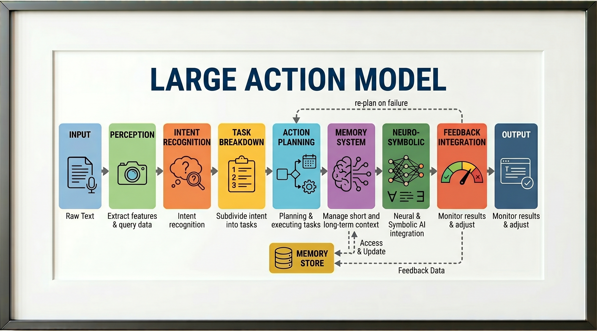
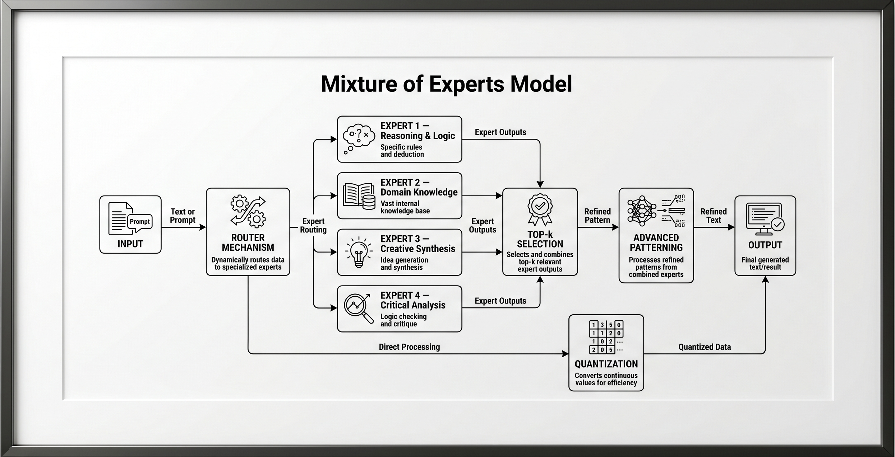
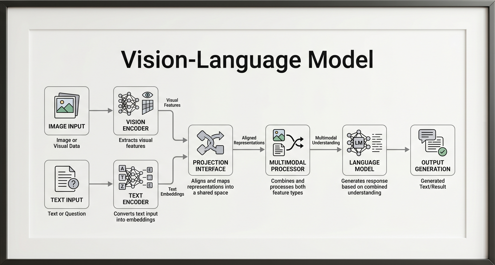
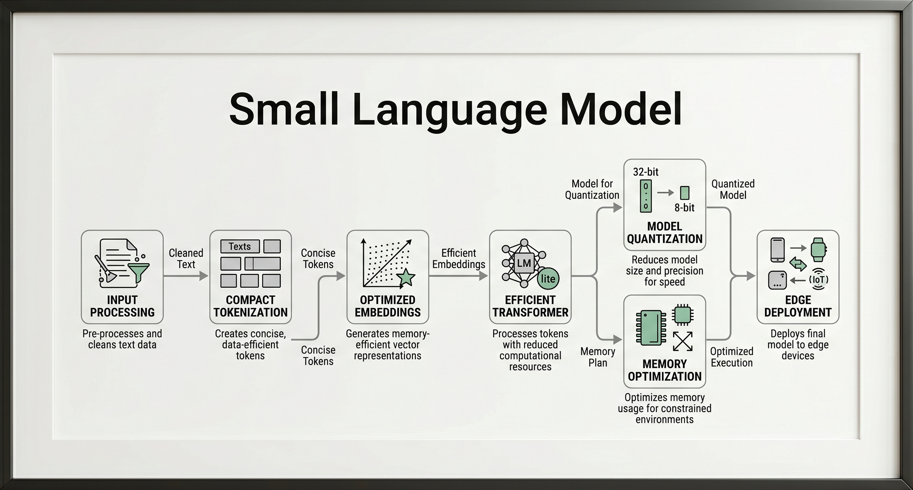

<h1 align="center">Specialized AI Models</h1>
A modular, production-grade repository showcasing distinct AI agent architectures. Built with a focus on type safety, observability, and deterministic stage execution.

## Table of Contents

- [Technical Stack](#️-technical-stack)
- [Project Overview](#-project-overview)
- [Quickstart](#-quickstart)
- [Agent: LLM (Large Language Model)](#-agent-1-llm-large-language-model)
- [Agent: LCM (Large Concept Model)](#-agent-2-lcm-large-concept-model)
- [Agent: LAM (Large Action Model)](#-agent-3-lam-large-action-model)
- [Agent: MoE (Mixture of Experts)](#-agent-4-moe-mixture-of-experts)
- [Agent: VLM (Vision-Language Model)](#-agent-5-vlm-vision-language-model)
- [Agent: SLM (Small Language Model)](#-agent-6-slm-small-language-model)
- [Logging & Observability](#-logging--observability)
- [Contributing](#-contributing)
- [Security & Secrets](#-security--secrets)

## 🏗 Project Overview

This architecture treats AI pipelines as strict, sequential data contracts. Each stage is a discrete, validated component.

### ⚙️ Core Engineering Features (Shared)

- **Strict Type Safety**: Pydantic v2 models rigorously validate data boundaries and ensure semantic correctness between pipeline stages.
- **Production Resiliency**: Exponential backoff (base 2, max 32s) and adaptive retry logic handle transient API failures. A circuit-breaker pattern prevents cascading failures.
- **State Checkpointing**: Centralized state management (`state_checkpointer.py`) saves intermediate stage payloads, allowing state resumption and preventing redundant API calls.
- **Deep Observability**: Structured, per-stage logging (`logging_setup.py`) tracks nanosecond-level execution timings (`time.perf_counter()`) and token efficiency.
- **Modularity**: Abstract base classes (`BaseAIAgent`) enforce a consistent, uniform interface across all distinct AI architectures.

## 🚀 Quickstart

**Prerequisites:** Python 3.11+

**Installation:**

```bash
uv venv
source .venv/bin/activate
uv pip install -r requirements.txt
```

**Configuration:**

```bash
cp .env.example .env
# Edit .env with your GITHUB_TOKEN and GITHUB_ENDPOINT
```

**Execution:**

```bash
python3 LLM.py
```

## 🔵 Agent 1: LLM (Large Language Model)

### Description

The LLM Agent is a lightweight, production-grade pipeline designed to transform raw text into structured, semantically-rich outputs. It operates through a deterministic, sequential architecture: Validation → Tokenization → Embedding → Transformer → Output Assembly.

**Pipeline Flow:**

<figure>
  
  <figcaption align="center">LLM pipeline flow</figcaption>
</figure>

| Stage            | Role                                    | Implementation Strategy          |
| :--------------- | :-------------------------------------- | :------------------------------- |
| **Input**        | Raw text ingestion & validation         | Pydantic model with guardrails   |
| **Tokenization** | Simulate token count, chunking strategy | tiktoken for real token counting |
| **Embedding**    | Semantic vector representation          | OpenAI text-embedding-3-small    |
| **Transformer**  | Attention-based reasoning & generation  | OpenAI gpt-4.1                   |
| **Output**       | Structured, validated response          | Pydantic output model + metadata |

### Use-Cases

- **Auditable Conversational Agents:** Chat applications that require strict provenance, logging exact input parameters, system prompts, and token usage for compliance or billing.
- **RAG Pre-processing Pipelines:** Systems that need both the generated transformer response and the embedded vector representation of the user's input for downstream semantic similarity tasks.
- **Format-Strict Text Generation:** Environments where model inputs must be guaranteed to fall under maximum token thresholds (default 8192) before being processed by expensive inference engines.

### Limitations

- **External API Dependency:** Operation is completely dependent on network connectivity to GitHub-hosted OpenAI models; latency is tied to API response times.
- **Synchronous Bottlenecks:** The pipeline processes stages sequentially and synchronously; a blocking delay in the embedding stage delays the transformer stage.
- **Static Context Windows:** Hardcoded boundaries (e.g., 8192 token max input, 4096 token max output) require code modifications to support dramatically larger

## 🟢 Agent 2: LCM (Large Concept Model)

### Description

The LCM (Large Concept Model) Agent is an advanced analytical pipeline that operates fundamentally in _latent concept space_ rather than surface token space. By treating segmented sentences as atomic conceptual units, it replicates Meta's SONAR architecture using mean-pooled embeddings, applies diffusion-based refinement, and extracts deep, hidden structural patterns across the text.

**Pipeline Flow:**

<figure>
  
  <figcaption align="center">LCM pipeline flow</figcaption>
</figure>

| Stage                     | Role                                                 | Implementation Strategy                               |
| :------------------------ | :--------------------------------------------------- | :---------------------------------------------------- |
| **Input**                 | Raw text ingestion                                   | Pydantic-validated input model                        |
| **Sentence Segmentation** | Split text into atomic conceptual units              | nltk sentence tokenizer                               |
| **SONAR Embedding**       | Concept-space semantic encoding (language-agnostic)  | Simulated via OpenAI embeddings + SONAR-style pooling |
| **Diffusion**             | Iterative concept refinement across embedding space  | Multi-step denoising loop over concept vectors        |
| **Advanced Patterning**   | Extract high-level abstract patterns                 | GPT-4.1 structural analysis pass                      |
| **Hidden Process**        | Latent concept clustering & cross-sentence inference | Cosine similarity clustering in embedding space       |
| **Quantization**          | Compress concept representation to discrete tokens   | Scalar quantization + codebook mapping                |
| **Output**                | Structured concept graph + generated insight         | Pydantic output with all stage payloads               |

### 🧠 Agent Capabilities

- **Language-Agnostic Concept Pooling:** Simulates Meta's SONAR architecture by generating per-sentence embeddings and mean-pooling them into a unified, language-agnostic concept vector—achieving high semantic fidelity without requiring local LASER2 models.
- **Latent Diffusion Refinement:** Employs a DDPM (Denoising Diffusion Probabilistic Models)-inspired iterative loop, injecting decaying Gaussian noise and reversing it via L2-normalization to continuously refine and stabilize the semantic concept vector.
- **Hidden Process Clustering:** Groups semantically related concept vectors using greedy cosine similarity (thresholding) and leverages LLM inference to dynamically extract unstated, cross-cluster emergent insights.
- **Uniform Scalar Quantization:** Compresses continuous 1536-dimensional float32 concept vectors into discrete 8-bit integer codes, achieving a 4x lossless compression ratio for highly efficient concept representation.

### Use-Cases

- **Deep Semantic Analysis:** Processing complex, dense texts (such as academic research or legal contracts) where underlying structural meaning, intent, and emergent themes matter significantly more than exact wording.
- **Cross-Lingual Concept Mapping:** Leveraging the simulated SONAR pooling architecture to cluster, compare, and connect conceptual similarities across documents written in entirely different languages.
- **Abstract Structural Summarization:** Extracting high-level, philosophical, or organizational patterns from large context windows using tunable "concept depth" instruction parameters.

### Limitations

- **High API & Latency Overhead:** Generating independent embedding vectors for _every single segmented sentence_ significantly increases API calls, processing time, and network latency compared to standard bulk vectorization.
- **Loss of Surface Context:** By projecting text into latent concept space and mean-pooling the results, exact phrasing, temporal sequencing, and surface-level syntax are inherently stripped away.
- **Clustering Threshold Sensitivity:** The "Hidden Process" stage relies on greedy cosine similarity with fixed clustering thresholds (e.g., 0.8), which may require manual tuning depending on the semantic density of the specific domain.

## 🟠 Agent 3: LAM (Large Action Model)

### Description

The LAM (Large Action Model) Agent is a production-grade autonomous orchestration system that operates fundamentally in _action space_ rather than token space. Acting as an "executive function" agent, it doesn't just generate text—it plans, validates, remembers, and adapts. The LAM breaks down complex, multi-step goals into directed task graphs and ultimately into verifiable, executable, and rule-validated tool calls, tightly coordinated by a central orchestrator.

**Pipeline Flow:**

<figure>
  
  <figcaption align="center">LAM pipeline flow</figcaption>
</figure>

| Stage                          | Role                                            | Implementation Strategy                        |
| :----------------------------- | :---------------------------------------------- | :--------------------------------------------- |
| **Input Processing**           | Validate & normalise raw action request         | Pydantic model with intent hints               |
| **Perception System**          | Sense & classify the environment/context        | GPT-4.1 context analysis → structured percepts |
| **Intent Recognition**         | Extract goal, sub-goals & constraints           | GPT-4.1 intent parser → IntentResult           |
| **Task Breakdown**             | Decompose intent into ordered atomic tasks      | GPT-4.1 planner → TaskGraph                    |
| **Action Planning**            | Generate executable action sequences per task   | Rule-engine + GPT-4.1 action synthesiser       |
| **Memory System**              | Maintain working memory across action steps     | In-process MemoryStore (episodic + semantic)   |
| **Neuro-Symbolic Integration** | Validate actions against symbolic rules & logic | Rule-engine with symbolic constraint checker   |
| **Feedback Integration**       | Simulate execution, collect feedback, re-plan   | Feedback loop with retry on failure            |
| **Output**                     | Final action plan + execution trace             | Structured LAMOutput                           |

### 🧠 Agent Capabilities

- **Action-Space Planning:** Decomposes abstract natural language intents into directed task graphs (`TaskBreakdownStage`) and concrete, tool-grounded action sequences with explicit parameters and expected outputs.
- **Dual-Layer Memory System:** Maintains a persistent `MemoryStore` split into _Episodic_ (event-tagged context) and _Semantic_ (fact-based knowledge) layers, allowing the agent to continuously enrich highly-relevant context during planning.
- **Neuro-Symbolic Validation:** Employs a hybrid validation engine that enforces non-negotiable, deterministic safety rules (Symbolic Pass) alongside adaptive, contextual evaluation (Neural Pass) before any action is approved for execution.
- **Adaptive Feedback loops:** Simulates the execution of planned actions to evaluate success, automatically triggering self-correction and iterative replanning cycles (up to 3 limits) when failures are detected.

### Use-Cases

- **Autonomous Research Assistants:** Agents capable of executing long-running, multi-step research tasks (like searching, reading, and synthesizing) while dynamically storing findings in memory and adapting to blocked paths.
- **DevOps & Infrastructure Bots:** Safe code execution or system administration agents that logically require strict, deterministic guardrails (e.g., "no data deletion without explicit backups") enforced by the Neuro-Symbolic integration stage.
- **Enterprise Workflow Automation:** Systems that execute heavily structured business processes requiring auditable task breakdowns, explicit tool-calling provenance, and robust recovery from transient tool failures.

### Limitations

- **High Pipeline Latency:** The comprehensive 9-stage architecture heavily relies on multiple sequential and complex LLM inferences, making it expensive and inherently unsuitable for real-time or low-latency chat interactions.
- **Simulation Reliance:** Currently, the feedback loop validates actions via LLM simulation; in real-world deployments, this requires hooking into actual environment execution feedback (e.g., CLI exit codes, HTTP statuses) which introduces external fragility.
- **Context Window Pressure:** Despite memory bounding (e.g., max 50 episodic slots), continuously injecting retrieved semantic and episodic memory blocks into replanning prompts can exhaust token limits or dilute model attention on complex tasks.

## 🟣 Agent 4: MoE (Mixture of Experts)

### Description

The MoE (Mixture of Experts) Agent brings the sparse activation architecture of models like Mixtral to the agent orchestration layer. It operates by evaluating incoming queries through a gating network (Router) and conditionally activating only the Top-k most relevant specialized expert personas. By enforcing true structural sparsity and leveraging parallel execution, it dynamically matches the right specialized reasoning to the right problem before synthesizing a fused, multi-perspective response.

**Pipeline Flow:**

<figure>
  
  <figcaption align="center">MoE pipeline flow</figcaption>
</figure>

| Stage                   | Role                                         | Implementation Strategy                                    |
| :---------------------- | :------------------------------------------- | :--------------------------------------------------------- |
| **Input**               | Validated query with expert hints            | Pydantic model with domain classification                  |
| **Router Mechanism**    | Score each expert's relevance to the input   | GPT-4.1 routing pass → softmax probability distribution    |
| **Expert 1**            | Reasoning & Logic Expert                     | Dedicated GPT-4.1 call with chain-of-thought system prompt |
| **Expert 2**            | Domain Knowledge Expert                      | Dedicated GPT-4.1 call with encyclopaedic knowledge prompt |
| **Expert 3**            | Creative Synthesis Expert                    | Dedicated GPT-4.1 call with divergent thinking prompt      |
| **Expert 4**            | Critical Analysis Expert                     | Dedicated GPT-4.1 call with adversarial evaluation prompt  |
| **Top-k Selection**     | Select best k expert outputs by router score | Weighted scoring → top-k filter + confidence gating        |
| **Advanced Patterning** | Extract cross-expert emergent patterns       | GPT-4.1 meta-synthesis over top-k outputs                  |
| **Quantization**        | Compress gating weights to discrete codes    | Scalar quantization of router probability vector           |
| **Output**              | Fused expert response with full provenance   | Structured `MoEOutput` with per-expert attribution         |

### 🧠 Agent Capabilities

- **Dynamic Gating & Routing:** Evaluates query relevance across all experts, applying softmax normalization to create a probability distribution while tracking Shannon entropy and load balance to monitor dispatch diversity and prevent "expert collapse".
- **Sparse Parallel Execution:** Structurally enforces sparsity by only calling the Top-k experts simultaneously via a `ThreadPoolExecutor`. Each expert utilizes a unique persona, temperature, and token budget, self-reporting a confidence score upon completion.
- **Cross-Expert Meta-Synthesis:** Analyzes raw expert outputs to classify inter-expert relationships (convergence, divergence, complementary, contradiction) before executing a weighted fusion pass to create a genuinely synthesized response with full provenance.
- **Probability Quantization:** Compresses the continuous 4-expert softmax weight distribution into discrete 8-bit scalar codes, calculating reconstruction error to monitor the precision cost of weight compression in real-time.

### Use-Cases

- **Multi-Disciplinary Problem Solving:** Evaluating complex architectural or strategic queries that require a blend of rigorous logic, domain knowledge, and creative synthesis, routed automatically to the best-suited personas.
- **Adversarial Review Pipelines:** Automatically dispatching proposals to a "Critical Analysis Expert" alongside a "Domain Expert" to stress-test ideas, identify assumptions, and steelman counterarguments before synthesizing a final verdict.
- **Dynamic Policy Orchestration:** Systems that need to handle highly varied user inputs (from code debugging to creative writing) efficiently, routing each request to a specialized prompt without exposing the entire context to one massive, generalized prompt.

### Limitations

- **Routing Overhead & Latency:** The pipeline requires sequential bottlenecks (routing must finish before experts run; experts must finish before synthesis runs), inherently increasing the time-to-first-token compared to single-shot inferences.
- **Context Window Amplification:** Synthesizing multiple expert outputs requires feeding all generated text (plus patterning instructions) into the final `AdvancedPatterningStage` context window, rapidly eating into token limits for verbose experts.
- **Expert Domain Overlap:** If expert system prompts are not sufficiently distinct, the router's softmax distribution will exhibit high entropy (indecision), leading to redundant responses and wasted compute during parallel activation.

## 🔴 Agent 5: VLM (Vision-Language Model)

### Description

The VLM (Vision-Language Model) Agent is a sophisticated multimodal orchestration pipeline that achieves deep visual-textual alignment through a sequential, multi-agent architecture. Mirroring the design patterns of models like LLaVA and Flamingo, it utilizes a dual-stream encoding approach: independently extracting visual feature maps and text embeddings. It then projects both modalities into a shared latent space, resolves conflicts via simulated cross-attention, and generates heavily grounded, visually-cited responses.

**Pipeline Flow:**

<figure>
  
  <figcaption align="center">VLM pipeline flow</figcaption>
</figure>

| Stage                    | Role                                                        | Implementation Strategy                                               |
| :----------------------- | :---------------------------------------------------------- | :-------------------------------------------------------------------- |
| **Image Input**          | Ingest, validate & preprocess image                         | Pydantic model; base64 encode from file/URL/bytes                     |
| **Text Input**           | Validate textual query/instruction                          | Pydantic model with prompt classification                             |
| **Vision Encoder**       | Extract visual features & patch embeddings                  | GPT-4.1 vision pass → structured visual feature map                   |
| **Text Encoder**         | Encode text into semantic representation                    | OpenAI text-embedding-3-small → semantic vector                       |
| **Projection Interface** | Align vision & text into shared latent space                | Learned-style linear projection simulation via cosine alignment score |
| **Multimodal Processor** | Cross-attention fusion of visual + textual tokens           | GPT-4.1 multimodal fusion with joint attention prompt                 |
| **Language Model**       | Generate grounded language output from fused representation | GPT-4.1 with vision — image + text in single call                     |
| **Output Generation**    | Structured, validated multimodal response                   | VLMOutput with full stage payloads                                    |

### 🧠 Agent Capabilities

- **Dual-Stream Encoding:** Independently processes text into dense semantic embeddings while using GPT-4.1's vision capabilities to extract a highly structured visual feature map (detecting scene types, objects, layout, regions, and spatial hints).
- **Latent Space Projection:** Computationally aligns vision and text representations using a Jaccard/cosine-similarity proxy, identifying shared explicit concepts to ensure both modalities are properly synchronized.
- **Cross-Attention Fusion:** Simulates explicit cross-attention by mapping specific textual query tokens to precise visual region IDs, generating a unified multimodal context and resolving visual-textual conflicts before final generation.
- **Deterministically Grounded Generation:** The final language model layer is forced to cite specific visual regions, producing both a traceable output and a calculated `grounding_score` to mathematically evaluate hallucination resistance.

### Use-Cases

- **Traceable Visual QA:** Enterprise applications (e.g., insurance claim evaluation, medical scan parsing) where answers must be explicitly tied to specific regions (e.g., "R001: top-left corner") rather than generalised guesses.
- **Multimodal RAG Ingestion:** Serving as a highly structured pre-processing engine that converts raw images into semantically aligned, tokenized JSON metadata (complete with depth, texture, and scene analysis) for vector storage.
- **Spatial & Scene Understanding:** Complex robotics or autonomous driving edge-cases where relative spatial layouts, depth estimation, and complex object interactions need thorough, deductive textual explanation.

### Limitations

- **Simulated Projection Constraint:** True VLMs use learned neural weights (like Perceiver resamplers or MLPs) to fuse embeddings; this agent approximates that fusion using sequential LLM reasoning passes, constraining alignment quality to the model's zero-shot contextual abilities.
- **Extreme Token & Latency Overhead:** Executing four sequential LLM/embedding calls (Vision, Text, Projection, Fusion) combined with high-detail image patch tokenization (up to 765 tokens per image) makes this pipeline inherently slow and token-expensive.
- **Heuristic Grounding Metrics:** The final `grounding_score` relies heavily on exact term-matching heuristics (checking if visual labels appear verbatim in the output text), which may underreport grounding if the model uses synonyms or implicit references.

## 🟡 Agent 6: SLM (Small Language Model)

### Description

The SLM (Small Language Model) Agent is an efficiency-first pipeline specifically engineered for resource-constrained environments like mobile devices, edge IoT, and microcontrollers. Inspired by models like Phi-3 and Gemma-2B, this architecture structurally enforces strict compute, memory, and latency constraints. Every stage of the pipeline—from multi-pass token compression and dimensionality reduction to aggressive quantization and KV caching—is optimized to maximize capabilities while minimizing the operational footprint, culminating in a mathematically rigorous efficiency scorecard.

**Pipeline Flow:**

<figure>
  
  <figcaption align="center">SLM pipeline flow</figcaption>
</figure>

| Stage                     | Role                                              | Implementation Strategy                                            |
| :------------------------ | :------------------------------------------------ | :----------------------------------------------------------------- |
| **Input Processing**      | Validate, normalise & budget-gate the input       | Pydantic model with strict token ceiling & device profile          |
| **Compact Tokenization**  | Aggressive token compression & deduplication      | tiktoken + BPE merging simulation + vocabulary pruning             |
| **Optimized Embeddings**  | Lightweight, dimension-reduced semantic vectors   | text-embedding-3-small with PCA-style dim reduction to 128-d       |
| **Efficient Transformer** | Inference with compute-budget constraints         | GPT-4.1 with strict token cap + latency tracking                   |
| **Model Quantization**    | Compress model weights to low-bit representation  | INT4/INT8 scalar quantization of embedding weights                 |
| **Memory Optimization**   | KV-cache simulation + memory footprint profiling  | In-process cache + memory budget enforcement                       |
| **Edge Deployment**       | Package response for resource-constrained targets | Payload sizing, latency SLA validation, device compatibility check |
| **Output Generation**     | Structured, validated lightweight response        | `SLMOutput` with full efficiency metrics                           |

### 🧠 Agent Capabilities

- **Target-Driven Execution Profiles:** Automatically calibrates latency SLAs, RAM limits, payload ceilings, and quantization modes based on explicitly defined hardware targets (`CLOUD`, `MOBILE`, `EDGE_IOT`, `MICROCONTROLLER`).
- **Aggressive Data Compression:** Implements a three-pass `CompactTokenizationStage` (truncation, duplicate removal, vocab coverage) and a seeded J-L orthonormalized projection matrix to reduce 1536-d embeddings to 128-d (achieving a 12x memory reduction).
- **Simulated Quantization & Caching:** Simulates INT4/INT8 post-training quantization across 7 neural network layers to track reconstruction MSE, while utilizing a SHA-256 keyed bounded LRU KV-Cache to skip recomputations for identical prompts.
- **Strict Edge Deployment Validation:** Employs Shannon entropy-based payload compression, gating the final output behind rigid SLAs (latency, size, ratio) and returning a `DEGRADED` status if the target hardware boundaries are breached.

### Use-Cases

- **IoT and Edge Computing:** Deploying intelligence directly to microcontrollers or edge sensors where RAM limits and network payloads are heavily constricted and round-trip latency to the cloud is unacceptable.
- **On-Device Mobile Applications:** Running lightweight semantic processing and generation directly on smartphones, effectively managing thermal limits and battery life through optimized KV-caching.
- **Cost-Optimized Batch Processing:** Utilizing the profound compression ratios to process massive datasets in cloud environments at a fraction of the compute and memory overhead of a traditional LLM.

### Limitations

- **Information Loss:** The aggressive pipeline dimensionality reduction (PCA approximation) and INT4/INT8 quantization inherently strip semantic nuance and increase reconstruction error, degrading output quality on highly complex tasks.
- **Extreme Context Constraint:** Enforces a hard cap of 512 input tokens (`SLM_MAX_INPUT_TOKENS`) and operates on a heavily pruned 32k vocabulary, making it completely unviable for long-context tasks like document summarization.
- **Degradation Sensitivity:** Because edge orchestration gates outputs based on strict hardware profiles, slight variations in prompt complexity easily trigger latency or memory SLA violations, marking the pipeline output as degraded.

## 📊 Logging & Observability

- Centralized logger configured via `logging_setup.py`.
- Centralized state checkpoint configured via `state_checkpointer.py`.
- Execution timings are tracked at the nanosecond level per stage using `time.perf_counter()`.
- Output is written locally to `logs/<agent_name>.log`.

## 🤝 Contributing

- Open an issue for architectural proposals.
- Maintain backward compatibility with the `BaseAIAgent` abstract interface.
- Ensure strict Pydantic v2 schema adherence for new data contracts.

## 🔒 Security & Secrets

- Do not commit `.env` files.
- Logs are sanitized locally. Ensure `system_prompt` and Pydantic object dumps do not expose user PII.

<h3 align="center">Made with ❤️ by Jiten.</h3>
